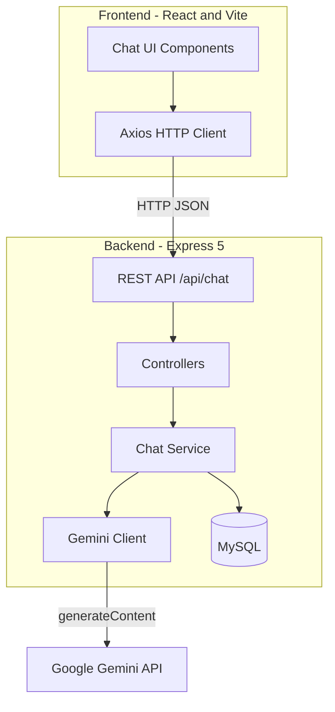
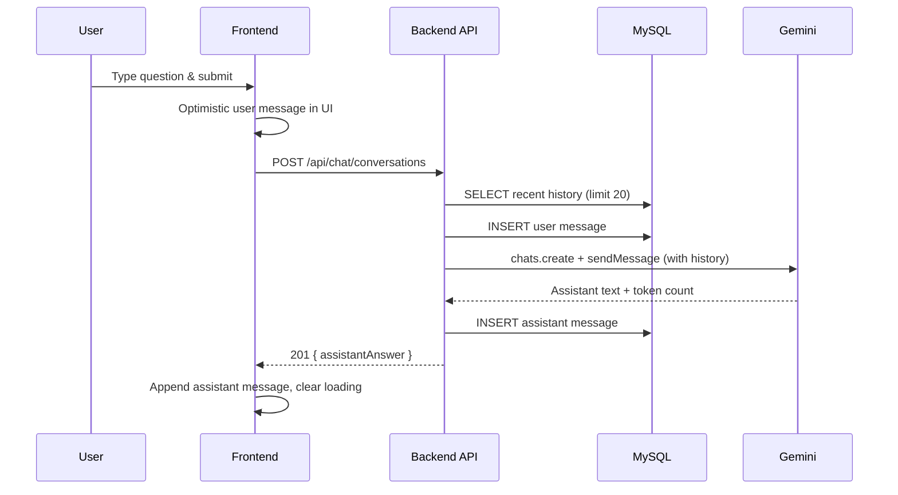

# 💬 ChatGPT Clone

> **A full-stack, ChatGPT-inspired chat application with persistent conversations, Google Gemini AI, and a polished dark UI.**

[](https://react.dev/)
[](https://vitejs.dev/)
[](https://expressjs.com/)
[](https://www.mysql.com/)
[](https://ai.google.dev/)

**Quick links:** [Features](#-features) · [Architecture](#-architecture) · [Getting Started](#-getting-started) · [API Reference](#-api-reference) · [Project Structure](#-project-structure)

---

## 📖 Overview

**ChatGPT Clone** is a modern web application that recreates the core ChatGPT experience: a sidebar navigation shell, a conversational main panel, real-time message exchange, and AI-powered replies. Users send questions through a sleek input bar; the backend persists every turn in **MySQL**, loads recent history as **conversation context**, and streams intelligence from **Google Gemini** with a software-engineering-focused system prompt.

The project is organized as a **monorepo** with separate `frontend` and `backend` packages, communicating over a REST API on port `5000`.

| Layer        | Role |
| ------------ | ---- |
| **Frontend** | React SPA — UI, state, API calls, Markdown rendering |
| **Backend**  | Express API — validation, persistence, Gemini integration |
| **Database** | MySQL — stores user & assistant messages with token counts |

---

## ✨ Features

### User experience
- 🎨 **ChatGPT-style dark theme** — charcoal sidebar (`#171717`), main panel (`#212121`), accent green (`#10a37f`)
- 📱 **Responsive layout** — sidebar + main chat column with sticky header and input
- 💬 **Live chat thread** — optimistic user messages, loading dots while the assistant replies
- 📝 **Markdown assistant replies** — formatted text via `react-markdown`
- 🔄 **Auto-scroll** — message list scrolls to the latest message on send/load
- 🧭 **Sidebar navigation shell** — New chat, Search, Images, Apps, Deep research, Codex, Projects (UI placeholders)

### Backend & AI
- 🤖 **Google Gemini integration** — context-aware multi-turn chat via `@google/genai`
- 🧠 **Conversation memory** — last 20 messages (configurable) sent as Gemini `history`
- 💾 **Persistent storage** — every user and assistant message saved to MySQL
- 📊 **Token tracking** — assistant responses store `token_count` from Gemini usage metadata
- 🛡️ **Domain-focused assistant** — system prompt limits answers to software engineering topics
- ⚠️ **Centralized error handling** — JSON error responses with appropriate HTTP status codes

---

## 🏗 Architecture

### High-level system diagram



### Message send flow



---

## 🛠 Tech Stack

### Frontend (`/frontend`)

| Technology | Purpose |
| ---------- | ------- |
| **React 19** | UI components & hooks |
| **Vite 8** | Dev server, HMR, production build |
| **Axios** | HTTP client for REST API |
| **Lucide React** | Icons (sidebar, avatars, input actions) |
| **React Markdown** | Render assistant replies as Markdown |
| **React Syntax Highlighter** | Code block styling (Prism / VS Dark+) |
| **CSS Modules** | Scoped component styles |

### Backend (`/backend`)

| Technology | Purpose |
| ---------- | ------- |
| **Node.js (ES Modules)** | Runtime |
| **Express 5** | HTTP server & routing |
| **mysql2/promise** | Connection pool & queries |
| **@google/genai** | Gemini chat sessions |
| **dotenv** | Environment configuration |
| **cors** | Cross-origin requests from Vite dev server |
| **nodemon** | Hot reload during development |

---

## 📁 Project Structure

```
ChatGpt-Clone/
│
├── 📂 backend/
│   ├── app.js                          # Express app entry & server bootstrap
│   ├── package.json
│   ├── .env                            # Secrets (not committed)
│   │
│   ├── 📂 api/
│   │   ├── main.routes.js              # Mounts /api/chat routes
│   │   └── 📂 chat/
│   │       ├── chat.routes.js          # GET/POST /conversations
│   │       ├── 📂 controller/
│   │       │   └── chat.controller.js
│   │       └── 📂 service/
│   │           └── chat.service.js     # DB + Gemini logic
│   │
│   ├── 📂 db/
│   │   ├── db.config.js                # MySQL connection pool
│   │   └── schema.sql                  # conversations table DDL
│   │
│   └── 📂 middleware/
│       └── error-handler.js            # Global JSON error responses
│
├── 📂 frontend/
│   ├── index.html
│   ├── vite.config.js
│   ├── package.json
│   │
│   └── 📂 src/
│       ├── App.jsx                     # Root state, API calls, layout
│       ├── App.css                     # Global theme variables & layout
│       ├── main.jsx
│       │
│       └── 📂 components/
│           ├── Sidebar/                # Navigation shell
│           ├── ChatHeader/             # Top bar (model label, avatar)
│           ├── MessageList/          # Scrollable message thread
│           ├── ChatMessage/            # Single message + Markdown
│           └── ChatInput/              # Form, send button, loading guard
│
└── README.md
```

---

## 🗄 Database Schema

Run `backend/db/schema.sql` against your MySQL database before starting the server.

```sql
CREATE TABLE IF NOT EXISTS conversations (
    id BIGINT UNSIGNED AUTO_INCREMENT PRIMARY KEY,
    role ENUM('user', 'assistant') NOT NULL,
    content TEXT NOT NULL,
    token_count INT UNSIGNED NOT NULL DEFAULT 0,
    created_at TIMESTAMP NOT NULL DEFAULT CURRENT_TIMESTAMP
);
```

| Column | Description |
| ------ | ----------- |
| `id` | Auto-increment primary key |
| `role` | `user` or `assistant` |
| `content` | Message text |
| `token_count` | Gemini usage (assistant rows only) |
| `created_at` | Insert timestamp |

---

## 🔌 API Reference

Base URL: `http://localhost:5000/api`

### `GET /chat/conversations`

Returns recent conversation messages (newest batch, reordered chronologically).

**Response `200`**
```json
{
  "status": true,
  "data": [
    {
      "id": 1,
      "role": "user",
      "content": "How do I reverse a string in JavaScript?",
      "token_count": 0,
      "created_at": "2026-05-26T12:00:00.000Z"
    }
  ],
  "message": "Conversations fetched successfully"
}
```

### `POST /chat/conversations`

Creates a user message, generates an assistant reply with Gemini, persists both rows.

**Request body**
```json
{
  "question": "Explain async/await in Node.js"
}
```

**Response `201`**
```json
{
  "status": true,
  "data": {
    "historyRows": [],
    "assistantAnswer": "Async/await is syntactic sugar over Promises..."
  },
  "message": "Conversation created successfully"
}
```

**Error `400`** — empty or whitespace-only question  
**Error `500`** — database or Gemini failures (handled by error middleware)

---

## 🚀 Getting Started

### Prerequisites

- **Node.js** 18+ (20+ recommended)
- **npm** or **yarn**
- **MySQL** 8+
- **Google Gemini API key** — [Get one from Google AI Studio](https://aistudio.google.com/apikey)

### 1. Clone the repository

```bash
git clone <your-repo-url>
cd ChatGpt-Clone
```

### 2. Database setup

```bash
mysql -u root -p
```

```sql
CREATE DATABASE chatgpt_clone;
USE chatgpt_clone;
SOURCE backend/db/schema.sql;
```

### 3. Backend configuration

Create `backend/.env`:

```env
PORT=5000

DB_HOST=localhost
DB_USER=root
DB_PASSWORD=your_mysql_password
DB_NAME=chatgpt_clone

GEMINI_API_KEY=your_gemini_api_key
GEMINI_MODEL=gemini-2.0-flash
```

> ⚠️ Never commit `.env` files. They are listed in `backend/.gitignore`.

### 4. Install & run backend

```bash
cd backend
npm install
node app.js
```

> **Note:** `package.json` scripts reference `index.js`, but the application entry file is `app.js`. Use `node app.js` directly, or update scripts to `"dev": "nodemon app.js"` and `"start": "node app.js"`.

Expected console output:

```
Successfully connected to the database
Server is running on http://localhost:5000
```

### 5. Install & run frontend

In a **new terminal**:

```bash
cd frontend
npm install
npm run dev
```

Open the URL shown by Vite (typically `http://localhost:5173`).

### 6. Verify end-to-end

1. Open the app in your browser.
2. Confirm prior messages load (if any exist in the database).
3. Type a programming question and press **Enter** or the send (↑) button.
4. Watch the loading indicator, then the assistant Markdown reply.

---

## 🎨 Design & UI

The interface closely follows ChatGPT’s visual language:

| Token | Value | Usage |
| ----- | ----- | ----- |
| Sidebar background | `#171717` | Left navigation panel |
| Main background | `#212121` | Chat area |
| Input background | `#2f2f2f` | Message composer |
| Primary text | `#ececec` | Headings & messages |
| Secondary text | `#b4b4b4` | Sidebar labels |
| Accent | `#10a37f` | Send button & highlights |
| Font | **Inter** (Google Fonts) | Global typography |

**Component breakdown**

| Component | Responsibility |
| --------- | -------------- |
| `Sidebar` | Static nav links (placeholders for future features) |
| `ChatHeader` | “ChatGPT” title + user avatar |
| `MessageList` | Empty state, message map, loading dots |
| `ChatMessage` | Role-based avatar; Markdown for assistant |
| `ChatInput` | Controlled input, mic placeholder, conditional send button |

---

## ⚙️ Configuration

| Variable | Required | Description |
| -------- | -------- | ----------- |
| `PORT` | No | API port (default `5000`) |
| `DB_HOST` | Yes | MySQL host |
| `DB_USER` | Yes | MySQL username |
| `DB_PASSWORD` | Yes | MySQL password |
| `DB_NAME` | Yes | Database name |
| `GEMINI_API_KEY` | Yes | Google AI API key |
| `GEMINI_MODEL` | Yes | Model id (e.g. `gemini-2.0-flash`) |

**Frontend API URL** — defined in `frontend/src/App.jsx`:

```js
const API_BASE_URL = 'http://localhost:5000/api';
```

Change this when deploying to production or using a different backend host.

---

## 🧪 Available Scripts

### Backend

| Command | Description |
| ------- | ----------- |
| `npm run dev` | Start with nodemon (update entry to `app.js` first) |
| `npm start` | Production start (update entry to `app.js` first) |
| `node app.js` | Run server directly ✅ |

### Frontend

| Command | Description |
| ------- | ----------- |
| `npm run dev` | Vite development server |
| `npm run build` | Production build to `dist/` |
| `npm run preview` | Preview production build |
| `npm run lint` | ESLint |

---

## 🗺 Roadmap

Ideas aligned with the current codebase and UI shell:

- [ ] Wire sidebar actions (New chat, Search, Projects)
- [ ] Multiple conversation threads / session IDs
- [ ] Syntax-highlighted code blocks in `ChatMessage` (dependency already installed)
- [ ] Streaming responses (SSE or WebSockets)
- [ ] User authentication & per-user history
- [ ] Environment-based `API_BASE_URL` via Vite `import.meta.env`
- [ ] Fix backend `package.json` entry point (`app.js` vs `index.js`)
- [ ] Register error middleware **after** routes in Express

---

## 🤝 Contributing

1. Fork the repository.
2. Create a feature branch: `git checkout -b feature/your-feature`
3. Commit changes with clear messages.
4. Open a pull request describing what changed and how to test it.

---

## 📄 License

This project is part of the **Evangadi Networks Full Stack — Phase 5** curriculum. Add your preferred license (e.g. MIT) before open-sourcing publicly.

---

---

**Built with React, Express, MySQL, and Google Gemini**

⭐ Star this repo if you find it useful!
